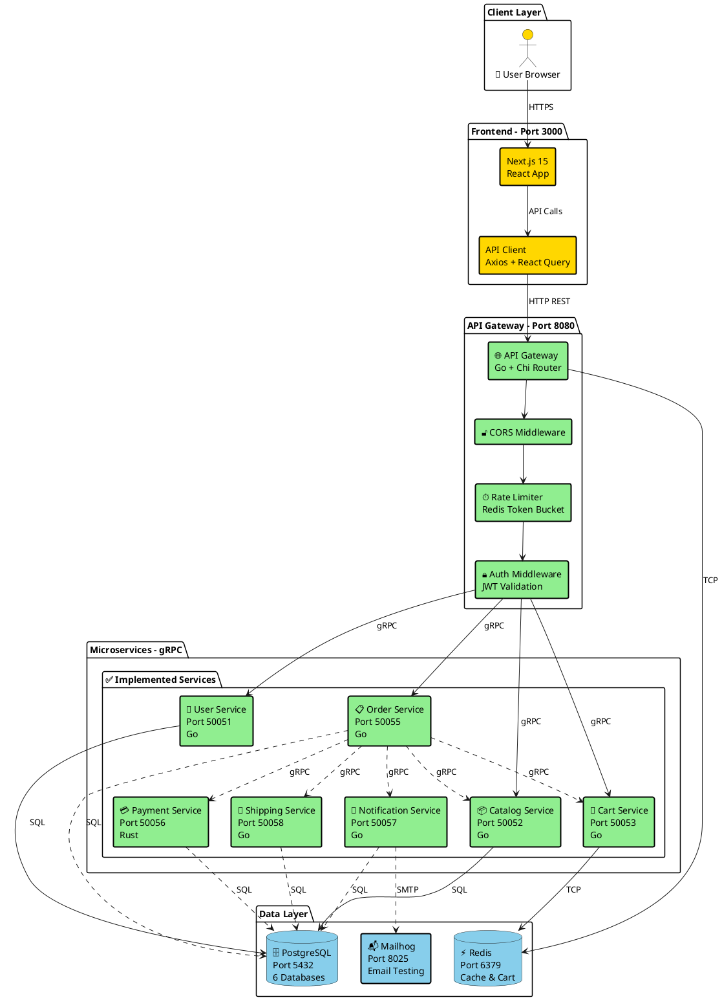
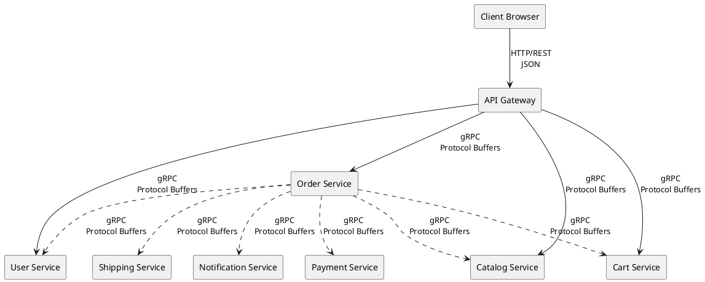

# Architecture Flow - Microservices E-commerce Platform

## System Architecture

---

## Service Communication Protocol

---

## Legend

- ✅ **Solid Lines**: Active/implemented connections
- ❌ **Dashed Lines**: Future/optional extensions
- 🟢 **Green**: Currently running services
- 🔴 **Pink**: Services not running
- 🔵 **Blue**: Infrastructure components
- 🟡 **Yellow**: Frontend components

---

**Last Updated:** 2026-02-16
**Services Implemented:** 8/8 + frontend
**Status:** Development - integration complete, polish/testing pending
